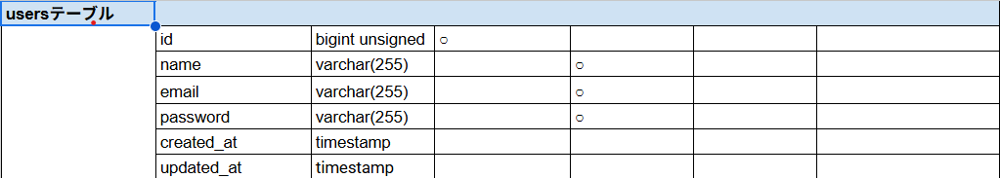
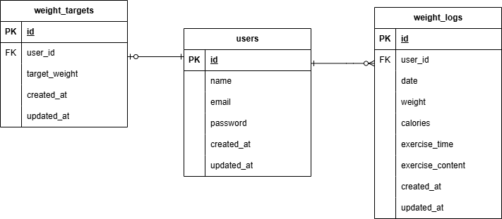

# Pigly

## 環境構築
**Dockerビルド**
1. `git clone git@git@github.com:renayashiki/pigly-test.git`
2. `cd /coachtech/laravel/pigly-test`
3. DockerDesktopアプリを立ち上げる
4. `docker-compose up -d --build`

**Laravel環境構築**
1. `docker-compose exec php bash`
2. `composer install`
3. 「.env.example」ファイルを 「.env」ファイルに命名を変更。または、新しく.envファイルを作成
4. .envに以下の環境変数を修正
``` text
DB_CONNECTION=mysql
DB_HOST=mysql
DB_PORT=3306
DB_DATABASE=laravel_db
DB_USERNAME=laravel_user
DB_PASSWORD=laravel_pass
```
5. アプリケーションキーの作成
``` bash
php artisan key:generate
```

6. マイグレーションの実行
``` bash
php artisan migrate
```

7. シーディングの実行
``` bash
php artisan db:seed
```

> 下記のダミーデータのログイン情報でログインすることが可能
``` bash
- email: test@example.com
- password: password
```

## 使用技術(実行環境)
- PHP: 7.3 〜 8.0
- Laravel: 8.75 以上
- MySQL: 8.0.26

## テーブル設計



## ER図



## URL
- 開発環境：http://localhost/
- phpMyAdmin: http://localhost:8080/
- ログイン画面: http://localhost/login
- 新規会員登録: http://localhost/register/step1
- 管理画面: http://localhost/weight_logs
